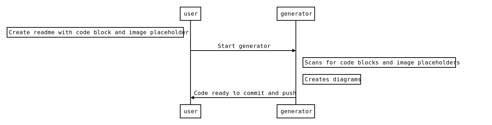

# readme diagrams generator

Generate diagrams in your readme files like this one:


<details><summary>raw</summary>

```js-sequence-diagram
Note left of user: Create readme with code block and image placeholder
user->generator: Start generator 
Note right of generator: Scans for code blocks and image placeholders
Note right of generator: Creates diagrams
generator->user: Code ready to commit and push

```
</details>

## Install

```bash
npm install -g readme-diagram
```

## Usage
In readme file place image holder:
```md

```

Then after that place a code block with language corresponding to code-name of diagram:

```md
    ```js-sequence-diagram
    Alice->Bob: Hello Bob, how are you?
    Note right of Bob: Bob thinks
    Bob-->Alice: I am good thanks!
    ```
```

To hide this code block put it into details:

```html
<details><summary>raw</summary>
    ...
</details>
```

Run generator:

```bash
readme-diagram --file my-readme.md
```

Generator will create diagrams and save them in path from image holder (in this example `relative/path/to/file.svg` which is relative to readme file).

## Supported diagrams and code-names
This tool supports diagrams from https://github.com/francoislaberge/diagrams


| diagram type | code-name |
|---|---|
|flowchart| `js-flowchart-diagram` |
|sequence| `js-sequence-diagram` |
|dot| `js-dot-diagram` |
|railroad| `js-railroad-diagram` |