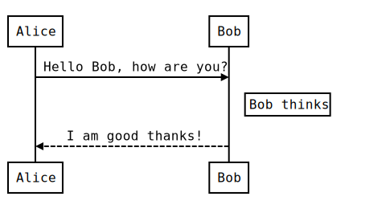
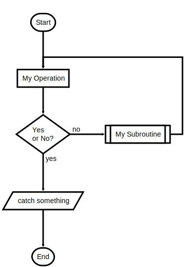

# Readme
Some text

## sequence diagram


<details><summary>raw</summary>

```js-sequence-diagram
Alice->Bob: Hello Bob, how are you?
Note right of Bob: Bob thinks
Bob-->Alice: I am good thanks!
```
</details>

## flowchart diagram


<details><summary>raw</summary>

```js-flowchart-diagram
st=>start: Start
e=>end
op1=>operation: My Operation
sub1=>subroutine: My Subroutine
cond=>condition: Yes
or No?:>http://www.google.com
io=>inputoutput: catch something
st->op1->cond
cond(yes)->io->e
cond(no)->sub1(right)->op1

```
</details>


## dot diagram


<details><summary>raw</summary>

```js-dot-diagram
digraph G {
    main -> parse -> execute;
    main -> init;
    main -> cleanup;
    execute -> make_string;
    execute -> printf
    init -> make_string;
    main -> printf;
    execute -> compare;
}

```
</details>

## railroad diagram


<details><summary>raw</summary>

```js-railroad-diagram
Diagram(
    Optional('+', 'skip'),
        Choice(0,
            NonTerminal('name-start char'),
            NonTerminal('escape')),
            ZeroOrMore(
                Choice(0,
                    NonTerminal('name char'),
                    NonTerminal('escape'))))

```
</details>
